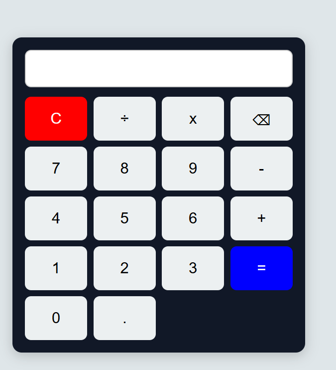

# 🧮 Calculator Web App

## 📌 Description
This is a simple Calculator Web Application developed using HTML, CSS, and JavaScript as part of my CodeAlpha Web Development Internship.

## ✨ Features
- Addition (+)
- Subtraction (-)
- Multiplication (×)
- Division (÷)
- Clear (C) button
- Delete (⌫) button
- Keyboard Support
- Responsive and Clean UI

## 🛠️ Technologies Used
- HTML5
- CSS3
- JavaScript

## 🚀 How to Run
1. Download or clone this repository.
2. Open the project folder.
3. Open `index.html` in your web browser.

## 📷 Screenshot

## 👨‍💻 Author
**Yash Raghuwanshi**